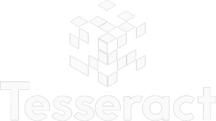

#   TESSERACT - CHALLENGE 

<h4 align="center">
    
</h4>

<h4 align='center'>
👉 Status: Concluído ✅👏
</h4>
<hr />

### ☁️ Deploy:

### ✨ Funcionamento:
- [x] Rotas
- [x] Página Home com a lista dos Membros com login e foto
- [x] Página Details com as informações de:
    - [X] Nome
    - [X] Quantidade de repositórios
    - [X] Quantidade de seguidores
    - [X] Data de entrada no Github
        - 🌟 PLUS:
        - [X] Localização
        - [X] Bio
        - [X] Direcionamento para o perfil no Github
        - [X] Direcionamento para o perfil no Twitter
- [x] Página de Erro
- [x] Responsividade para iPhones 6/7/8 e iPad

### 💻 Tecnologias:
As seguintes tecnologias foram usadas na construção do projeto:
- [React](https://pt-br.reactjs.org/)
- [JavaScript](https://www.javascript.com/)
- [Material-UI](https://material-ui.com/pt/)

### 🎨 Layout:
- Material-UI
- Styled-componentes

# 📂 Como instalar o projeto:

##### Passo 1. Clone este repositório:
```
$ git clone https://github.com/julianapedroso/tesseract-group-challenge.git
```
##### Passo 2. Acesse a pasta do projeto no terminal/cmd:
```
$ cd tesseract-challenge
```

##### Passo 3. Instale as dependências:
```
$ npm install
```

##### Passo 4. Rode o projeto:
```
$ npm run start
```

##### Passo 5. Abra em seu navegador o seguinte endereço: [http://localhost:3000](http://localhost:3000)

<br />

### 📷 Prints:


<hr />